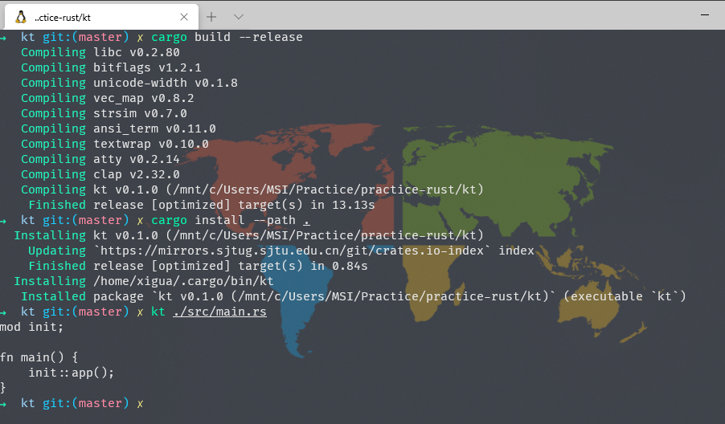

## kt-rs

A drop-in cat replacement written in Rust.

### Usage

```bash
$ kt -h

kt 0.0.1
xi gua <tomato.stao@gmail.com>
A drop in cat replacement written in Rust

USAGE:
    kt [FILE]

FLAGS:
    -h, --help       Prints help information
    -V, --version    Prints version information

ARGS:
    <FILE>    FILE to print.
```

### Preview

